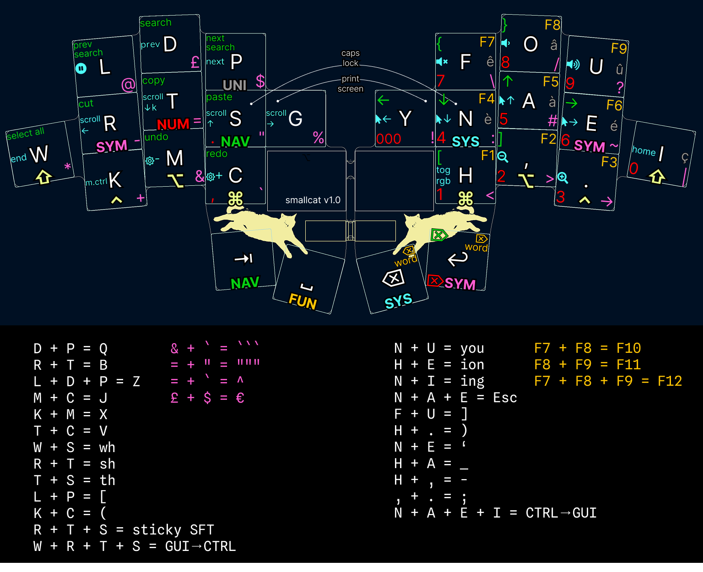

# Smallwat3r's QMK keymap

Layout heavily inspired from Graphite with some modifications in order to accommodate 26 keys and reduce usage of pinky fingers.

Highly relying on combos from the base layer. I'm currently using very light switches (Ambients Nocturnal from Kailh, 20g), which makes using combos very easy.

I use `./cp-smallcat` to copy the Smallcat keyboard configs onto my local QMK firmware repository.

Compile firmware
```
qmk compile -kb smallcat -km default 
```

Flash firmware
```
qmk flash -kb smallcat -km default 
```



I'm using an implementation of Magic Key (❖) on the 3 home key combos (<kbd>R</kbd><kbd>S</kbd><kbd>T</kbd> and <kbd>N</kbd><kbd>A</kbd><kbd>E</kbd>).

| Combo                    | Output |
|--------------------------|--------|
| <kbd>d</kbd><kbd>❖</kbd> | def    |
| <kbd>m</kbd><kbd>❖</kbd> | ment   |
| <kbd>r</kbd><kbd>❖</kbd> | return |
| <kbd>t</kbd><kbd>❖</kbd> | tment  |
| <kbd>s</kbd><kbd>❖</kbd> | sion   |
| <kbd>c</kbd><kbd>❖</kbd> | class  |
| <kbd>o</kbd><kbd>❖</kbd> | on't   |
| <kbd>y</kbd><kbd>❖</kbd> | you    |
| <kbd>n</kbd><kbd>❖</kbd> | nion   |
| <kbd>i</kbd><kbd>❖</kbd> | import |
| <kbd>I</kbd><kbd>❖</kbd> | I'm    |
| <kbd>,</kbd><kbd>❖</kbd> | , but  |
| <kbd>.</kbd><kbd>❖</kbd> | ../    |
| <kbd>+</kbd><kbd>❖</kbd> | +=     |
| <kbd>-</kbd><kbd>❖</kbd> | -=     |
| <kbd>=</kbd><kbd>❖</kbd> | =>     |
